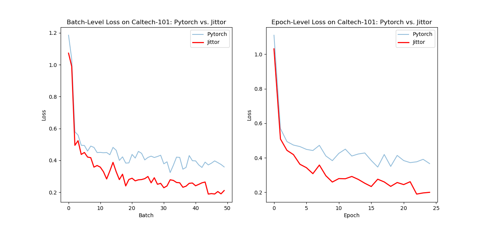
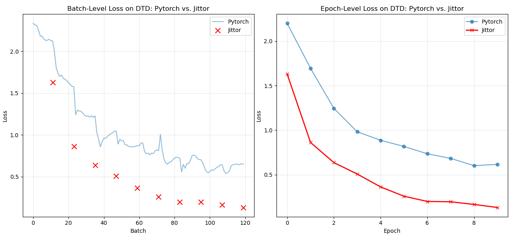
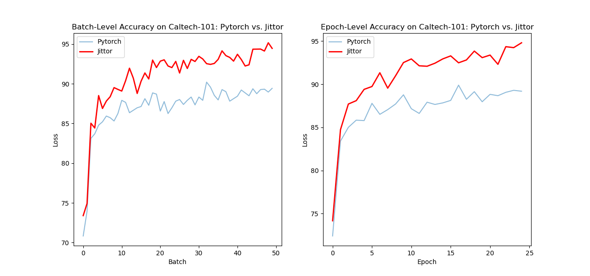
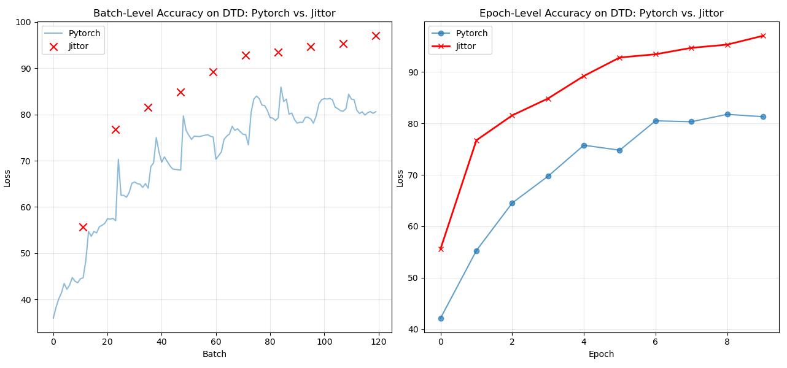
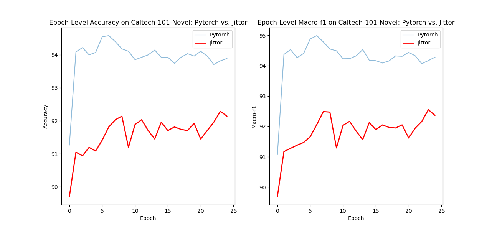
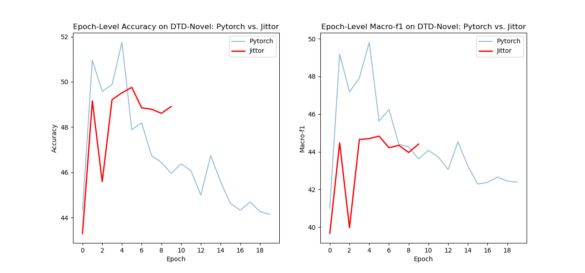

# Jittor_ATPrompt
Jittor implementation of ATPrompt algorithm, with alignment verification against PyTorch version

本项目是对ICCV 2025论文《Advancing Textual Prompt Learning with Anchored Attributes》的复现，使用国产的Jittor深度学习框架实现。

## 📖 论文简介

**ATPrompt**（基于属性锚点的文本提示学习方法）核心是解决现有视觉 - 语言模型 “仅能对齐已知类别、无法关联未知类别” 的问题，核心思路可简化为两点：

1. 用通用属性当 “桥梁”：引入颜色、形状、材质等通用属性，让模型在学习类别特征时，额外掌握属性相关的通用表征，从而帮图像与未知类别的文本建立对齐关系，突破仅适配已知类别的局限。

2. 自动选属性且即插即用：通过可微分算法从候选池中自动筛选适配任务的最优属性，同时能像插件一样无缝替换现有文本提示形式，无需额外计算开销，就能为基线模型提升性能。

## 🏗️ 项目结构

```
📦 atprompt/
├── 📄 train.py             # 训练/测试入口脚本
├── 📄 convert_clip_weights.py  # CLIP模型权重转换
├── 📄 requirements.txt     # 依赖清单
├── 📄 README.md            # 项目说明
├── 📁 datasets/            # 数据集处理：
│   ├── 📄 caltech101.py    # Caltech-101数据集
│   ├── 📄 dtd.py           # DTD数据集
│   └── 📄 oxford_pets.py   # Oxford Pets数据集
├── 📁 scripts/             # 可直接运行的训练测试脚本
├── 📁 trainers/            # 训练器实现：
│   ├── 📄 coop.py          # 基础COOP
│   └── 📄 coop_atp.py      # ATPrompt+COOP
├── 📁 clip/                # CLIP模型及扩展
├── 📁 configs/             # 实验配置
├── 📁 interpret_prompts/   # Prompt可解释性分析
├── 📁 Dassl.pytorch/       # 基于Jittor修改的Dassl框架
├── 📁 expr/                # 完整Log
└── 📁 output/              # 输出目录
```

## 🚀 快速开始

### 1. 环境准备

项目环境配置为：ubuntu2204、g++-11、jittor1.13.0、cuda12.1
```bash
# 安装依赖
pip install -r requirements.txt/
cd Dassl.pytorch/
pip install -r requirements.txt/
python setup.py develop
```

### 2. 数据准备

确保数据集已下载并按以下结构组织：

```
root/prompt_dataset/
├── caltech-101/
│   ├── 101_ObjectCategories/
│   │   ├── accordion/
│   │   ├── airplanes/
│   │   └── ...
│   └── Annotations/
└── dtd/
    ├── images/
    ├── labels/
    └── imdb/

```


### 3. 运行CoOp+ATP训练与实验

```bash
bash scripts/coop/atp_base2new_train.sh caltech101
bash scripts/coop/atp_base2new_test.sh caltech101
bash scripts/coop/atp_base2new_train.sh dtd
bash scripts/coop/atp_base2new_test.sh dtd
```

## 🔬 实验设置

### 任务序列
- **任务1**: Caltech-101 Base-to-Novel (在50个类别上做16shot训练，在剩余51个Novel类别上测试)
- **任务2**: DTD Base-to-Novel (在24个类别上做16shot训练，在剩余23个类别上测试)  

### 网络架构
- **基础模型**: ViT/B-16

### ⚠️简化流程
- 为了快速验证，暂时没有进行原文中的属性可微搜索，直接选择了作者提供的各数据集上预设的最高权重属性。


## 🎯 实验结果


### Jittor 复现结果 vs. 论文报告结果 (三次运行取平均后 Top-1 准确率 %)

| **任务** | **Jittor 复现** | PyTorch复现 |  **原论文** |
| :--- | :---: | :---: | ----- |
| Caltech-101 | 92.29% | 94.54% | 95.74% |
| DTD | 49.76% | 51.75% | 58.22% |

* CLIP权重转换为pkl文件再向jt.Var过程中有精度损失。
* 深度学习框架不同。

### 训练过程

#### 训练收敛情况


#### 在Base类别上的性能


### 在Novel类别上的性能


### 完整Log
可见expr文件夹


## 🎛️ 可配置参数

```bash
# Caltech101数据集训练配置
CFG=vit_b16      #可选择CLIP的backbone
SHOTS=16         #base类别上的训练样本数
CTP=end          #类别词元位置
TRAINER=CoOp_ATP #是否选择使用ATPrompt
EPO=25           #迭代轮数
NCTX=4           #各属性可学习的词元数

# DTD数据集训练配置  
CFG=vit_b16      #可选择CLIP的backbone
SHOTS=16         #base类别上的训练样本数
CTP=end          #类别词元位置
TRAINER=CoOp_ATP #是否选择使用ATPrompt
EPO=10           #迭代轮数
NCTX=2           #各属性可学习的词元数
```

## 备注

1. **训练资源**: 在AutoDL平台的单卡TiTan Xp上训练，显存占用约5GB

## 📚 参考文献

```bibtex
@article{li2024advancing,
  title={Advancing Textual Prompt Learning with Anchored Attributes},
  author={Li, Zheng and Song, Yibing and Cheng, Ming-Ming and Li, Xiang and Yang, Jian},
  journal={arXiv preprint arXiv:2412.09442},
  year={2024}
}
```
